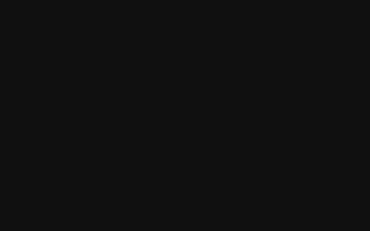

# Matinée

[](https://github.com/deshpanda/matinee/actions/workflows/checks.yml)
[](docs/DESIGN.md)
[](https://github.com/deshpanda/matinee/actions/workflows/imdb-slice.yml)

**Your film life, developed in your browser.**



Drop your Letterboxd export onto the page and Matinée develops the whole
print locally: watching stats, poster walls, a world map of your cinema, a
century timeline, taste-weighted recommendations, and a four-year film-school
transcript graded from your own ratings — all computed **inside your
browser**, stored **only in your browser**.

There is no server. No account. No analytics. We could not see your data if
we wanted to. (The develops badge above is the entire telemetry story: one
empty ping when a develop completes, carrying no body and no identifier,
plus the anonymous request counts every edge network keeps. By construction
none of it can know who you are.)

## How it works

```
your Letterboxd ZIP ──▶ parsed in-tab ──▶ TMDB garnish (your browser ⇄ TMDB)
                                  │
                                  ▼
                    insights + shelves + transcript
                                  │
                                  ▼
                        IndexedDB (this browser only)
```

1. Export your data from Letterboxd (**Settings → Data → Export**).
2. Drop the ZIP (or the CSVs inside it) onto the landing page.
3. The darkroom narrates the develop: your films are matched against TMDB
   from your own browser, insights are computed, shelves are cut.
4. The finished print lives in your browser's IndexedDB. **Eject** wipes it.

Not sure yet? Two ways to try before you export: type your **Letterboxd
username** for a thirty-second trailer of your last fifty films, or open the
**demo print** — a fictional cinephile's finished dashboard — and walk every
room first.

## The rooms

| Page | What hangs there |
| --- | --- |
| **Overview** | The hero numbers, the year-by-year heatmap reel, last screenings, and rating-tier poster walls |
| **Stats** | Habits, taste, the map of world cinema, the century strip, terra incognita, verdicts, years in review |
| **Next** | Recommendation shelves weighted by your own ratings — because-you-loved, short reels, the long haul, unmet masters, the canon board — with TMDB and IMDb ratings on every card |
| **School** | A 31-course film school (BA + MFA) graded from your ratings: transcript, GPA, dean's list, the seminar room's method and vocabulary |
| **Archive** | The full ledger, searchable, beside the margins — your own reviews |

## Press kit

Ready-made assets for posts and write-ups, all recorded from the live site with
the demo print (no personal data on screen). Click through, then use the raw
download button on the file page.

| File | What it is | Use it for |
| --- | --- | --- |
| [matinee-walkthrough.mp4](media/matinee-walkthrough.mp4) | 63 second silent walkthrough, 1280x800, captioned | link posts, YouTube, embeds |
| [matinee-square.mp4](media/matinee-square.mp4) | the same cut, 1080x1080 letterboxed | feeds that crop wide video |
| [matinee-teaser.gif](media/matinee-teaser.gif) | 12 seconds of the develop, 2 MB | inline embeds, comment replies |
| [still-transcript.png](media/still-transcript.png) | the film school transcript | the single best still: it shows a GPA |
| [still-map.png](media/still-map.png) | the map of world cinema | |
| [still-recommendations.png](media/still-recommendations.png) | the recommendation shelves | |
| [card-intro.png](media/card-intro.png) / [card-outro.png](media/card-outro.png) | the title cards | thumbnails, banners |
| [assets/og.png](assets/og.png) | 1200x630 Open Graph card | link previews |

The walkthrough is deliberately silent: most feeds autoplay muted and the
captions carry it. Add music in any editor if a platform wants sound.

### Re-cutting it

The whole film is reproducible from the live site, so it can be refreshed
whenever the UI changes:

```bash
cd tools/video
npm install playwright        # uses a cached Chromium if you have one
node record.mjs               # drives the live site, writes out/ + timeline.json
node cards.mjs                # renders title cards and captions in the site's own CSS
./cut.sh                      # assembles mp4 + square + gif into dist/
```

`record.mjs` holds the scene list and the pacing; `cards.mjs` holds the caption
copy; `cut.sh` holds the speed (`SPEED=1.35`) and caption dwell time. Captions
are timed from the marks the recorder writes, so changing the route through the
site does not desynchronise them. Requires `ffmpeg` on PATH for the cut step.

## Deploying your own

It's a static site — fork, enable GitHub Pages, done. One config:
[`assets/config.js`](assets/config.js) needs a free TMDB API key
(themoviedb.org → Settings → API). Rebuild the committed data files any time
with:

```
TMDB_KEY=... node tools/make-syllabus.mjs   # film-school metadata
TMDB_KEY=... node tools/make-demo.mjs       # the demo print
```

`node --test` covers the engine: CSV parsing, the insights math, the
recommendation ranker, the transcript grader.

## The edges

Two small pieces live outside the browser — neither ever sees viewer data
(principles in [ARCHITECTURE.md](ARCHITECTURE.md), full HLD/LLD with diagrams in [docs/DESIGN.md](docs/DESIGN.md)):

- **`pipeline/` — Go.** Prunes IMDb's non-commercial datasets to a 1.2 MB
  slice ([`data/imdb-slice.json`](data/imdb-slice.json)) that the browser
  joins locally, so every shelf carries an IMDb second opinion. A GitHub
  Action re-cuts it weekly; nothing to host.
- **`api/` — Rust on Cloudflare Workers.** The username teaser
  (`/teaser/:user` — Letterboxd's public RSS has no CORS, so the landing-page
  preview needs one hop) and the TMDB proxy every film lookup goes through —
  the key stays server-side, and the worker sees anonymous "give me movie
  #550" requests it cannot connect to anyone. It holds no state and never
  sees export data. Forks deploy their own with `npx wrangler deploy` from
  `api/`, set the secret with `wrangler secret put TMDB_KEY`, and point
  `WORKER_URL` in [`assets/config.js`](assets/config.js) at it — the landing
  page grows the preview box on its own (leave it empty and the teaser
  simply stays hidden).

CI (`.github/workflows/checks.yml`) runs the Node test suite, vets and
builds the Go, and `cargo check`s the worker against the wasm target on
every push.

---

Not affiliated with Letterboxd. This product uses the TMDB API but is not
endorsed or certified by TMDB.
