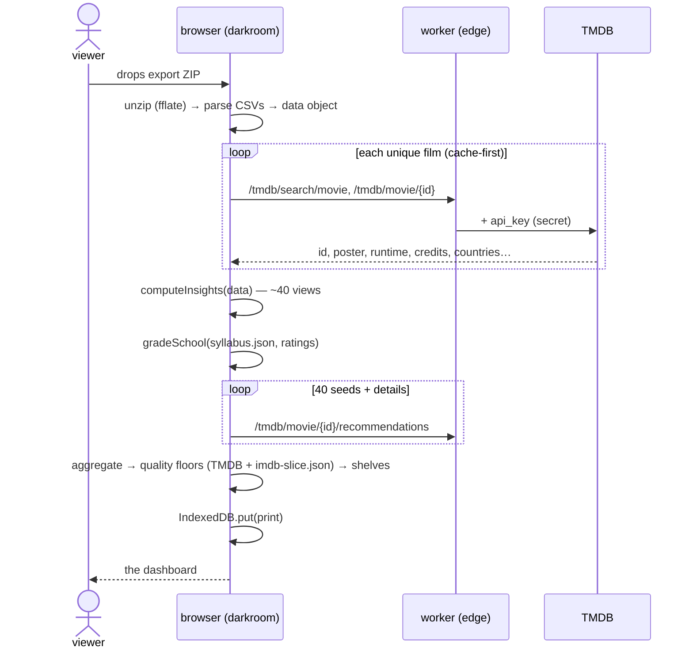

# Matinée — design

High-level design first, then the low-level details per component. The one
sentence that constrains everything: **viewer data never touches
infrastructure we run.**

## HLD — system context

```mermaid
flowchart LR
    subgraph viewer's browser
        L[landing / darkroom] --> E[engine<br/>parse → enrich → insights → shelves]
        E --> IDB[(IndexedDB<br/>the print)]
        IDB --> P[five pages<br/>overview · stats · next · school · archive]
    end
    subgraph our infrastructure — sees no viewer data
        W[Rust worker<br/>Cloudflare edge]
        GH[GitHub Pages<br/>static assets + weekly data]
    end
    X[Letterboxd export ZIP] -->|drag & drop| L
    L -->|/teaser/:user| W
    E -->|/tmdb/* anonymous lookups| W
    W --> LB[letterboxd.com RSS]
    W --> TMDB[api.themoviedb.org]
    GH -->|html · js · syllabus.json · imdb-slice.json| P
```

Three runtimes, each where it's irreplaceable:

| Runtime | Where | Why there |
| --- | --- | --- |
| **JavaScript** | visitor's browser | the privacy model *requires* computation client-side; the data may not leave |
| **Rust** | Cloudflare Workers | the two things a browser can't do: read Letterboxd's CORS-less RSS, hold the TMDB key |
| **Go** | GitHub Actions | batch-crunch IMDb's 200 MB datasets into a 1.2 MB browser-joinable slice, weekly |

**Trust boundaries.** The worker sees anonymous film lookups (`GET
/tmdb/movie/550`) and teaser usernames (already-public Letterboxd handles);
it holds no state and cannot associate requests with people. GitHub Pages
serves static files and sees standard web logs we never access. The export,
the ratings, the computed print — browser only.

**Failure posture.** Every dependency degrades instead of blocking: no
worker → direct TMDB with the fallback key; no IMDb slice → TMDB-only
quality floor; no TMDB at all → the demo print still works. The develop is
resumable in spirit: enrichment is cache-first in IndexedDB, so a re-drop
skips everything already looked up.

## HLD — the develop (the one flow that matters)



## LLD — the browser engine (`lib/`)

| Module | Responsibility | Pure? |
| --- | --- | --- |
| `csv.js` | RFC-ish CSV: quotes, CRLF, embedded newlines | ✔ tested |
| `export-parse.js` | Letterboxd CSVs → `{diary, watched, ratings, watchlist, reviews}`; diary stands in for a missing watched.csv | ✔ |
| `enrich.js` | per-film TMDB search + details+credits; marquee-name rule for co-directors (highest person popularity); misses cached as `false` so they're never retried | I/O at edges |
| `insights.js` | the stats engine — totals, streaks, heatmaps per year, genres/directors/decades, calibration vs the crowd, wall tiers, country films, release-year census, ledger | ✔ tested |
| `school.js` | `gradeSchool(syllabus, viewerKeys)` — per-course grades (ratings → 4.0 scale), GPA, dean's list (course avg ≥ 4.5★), standing ladder, the semester in session | ✔ tested |
| `shelves.js` | recommendation shelves (below) + IMDb slice join | I/O at edges |
| `recs.js` | scoring math + content: 48-director canon, 31-course syllabus, 30-term lexicon | ✔ tested |
| `store.js` | IndexedDB: `kv` (the print, one blob) + `tmdb` (enrichment cache) | — |
| `render.js` | hand-rolled SVG: bars, heatmaps, scatter, world map, century strip | — |

**Recommendation scoring** (the heart of `next`): films rated ≥ 3.5★ become
seeds with `weight = rating − 3`. Each seed's TMDB `/recommendations` list
contributes to every candidate it mentions:

```
score += weight × 1/(1 + rank×0.12) × (tmdbRating/10)³ × min(1, log₁₀(votes+1)/3.5)
```

The cube is the taste gate — a 6.5-rated film contributes ~27% of an 8.2's
prior instead of ~79%. Candidates are excluded by watched id *and*
normalized title+year (no remakes of things you've seen), tiny-vote films
need ≥ 2 seeds to survive, and the final floor demands IMDb ≥ 6.8 (or
TMDB ≥ 7.2 when the two crowds disagree; TMDB ≥ 6.8 when IMDb is silent).
Shelves then carve one pool without repeats; the *masters* shelf is
deliberately non-algorithmic — canon directors with zero diary entries,
ranked by genre affinity, because collaborative filtering only ever echoes.

**Keying.** Films are keyed `name|year` from the export; all joins
(enrichment, ratings, IMDb slice, syllabus) go through
`normTitle = lowercase, non-alphanumerics → single space, trim` — mirrored
byte-for-byte in the Go pipeline.

## LLD — the worker (`api/`, Rust)

| Route | Upstream | Notes |
| --- | --- | --- |
| `GET /teaser/:user` | `letterboxd.com/{user}/rss/` | username whitelist `[A-Za-z0-9_-]{1,32}`; browser UA (the feed 403s bots); hand-rolled tag extraction — no XML dep; 404 mapped to "no such member" |
| `GET /tmdb/*` | `api.themoviedb.org/3/*` | query passthrough + `api_key` from secret; browser UA (header-less edge fetches get CF error 1042); upstream headers are immutable → response rebuilt before CORS decoration |
| `GET /badge` | Cloudflare GraphQL analytics | shields.io endpoint JSON with 7-day request count; needs the `CF_ANALYTICS_TOKEN` secret, degrades to a "no token" badge without it |

All responses: `Access-Control-Allow-Origin: *`, `s-maxage` 6 h (teaser) /
24 h (tmdb) / 1 h (badge). Secrets: `TMDB_KEY`, `CF_ANALYTICS_TOKEN`
(optional). Deploy: `npx wrangler deploy` from `api/`.

## LLD — the pipeline (`pipeline/`, Go)

Weekly (`.github/workflows/imdb-slice.yml`, Mondays 03:41 UTC):

1. Stream `title.ratings.tsv.gz` → allowlist of tconsts with ≥ 2500 votes.
2. Stream `title.basics.tsv.gz` (~200 MB) → for allowlisted `movie`/`tvMovie`
   rows, emit `normTitle(title)|year → [rating, votes]` under both primary
   and original titles (a viewer logs *Seven Samurai*; IMDb's original is
   *Shichinin no Samurai*); highest vote count wins key collisions.
3. Write `data/imdb-slice.json` (~1.2 MB, ~30k films); commit only on change.

The same job re-resolves `data/syllabus.json` (posters and crowd ratings
drift) via `tools/make-syllabus.mjs`.

## Build-time tools (`tools/`, Node)

- `make-syllabus.mjs` — the 31-course syllabus against TMDB once: ids,
  posters, crowd ratings, marquee directors. Comma-heavy titles retry on the
  pre-comma stem but accept only exact normalized-title matches (so a
  making-of documentary can't stand in for *Jeanne Dielman*).
- `make-demo.mjs` — a fictional cinephile's diary through the identical
  pipeline → `data/demo.json`, the walkthrough print.
- `make-worldmap.mjs` — Natural Earth GeoJSON → equirectangular SVG paths
  (`assets/worldmap.js`, 75 KB, dynamically imported by the stats page only).

## CI

`checks.yml` on every push: `node --test` (30 tests over the pure engine),
`go vet && go build`, `cargo check --target wasm32-unknown-unknown`.

## Explicit non-goals

No accounts, no server-side storage of viewer data, no scraping — the
export and the public RSS feed are the only sources, both owner-initiated.
No analytics beyond the worker's anonymous request counts.
